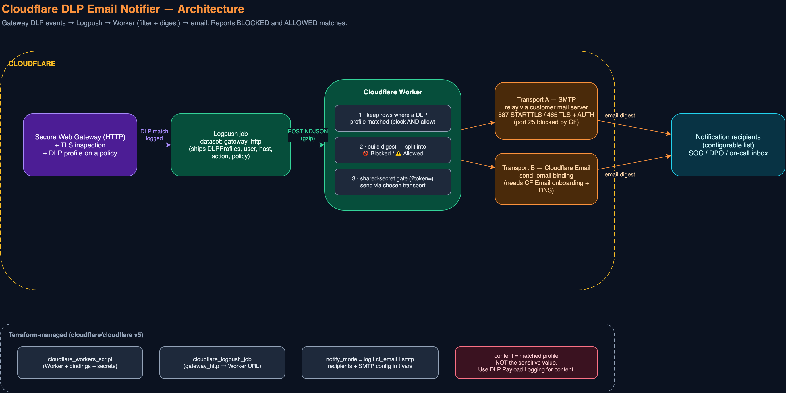
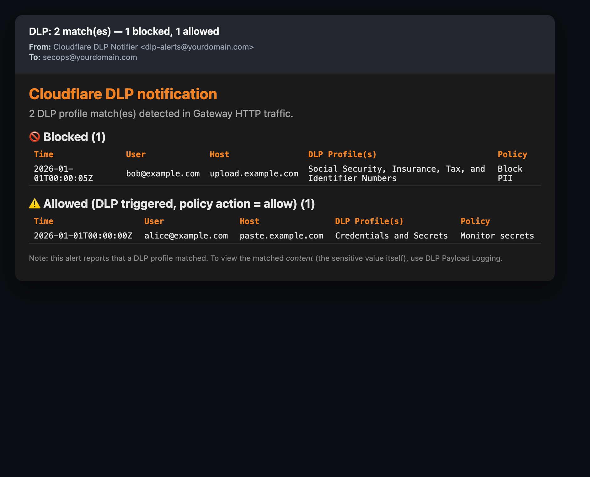
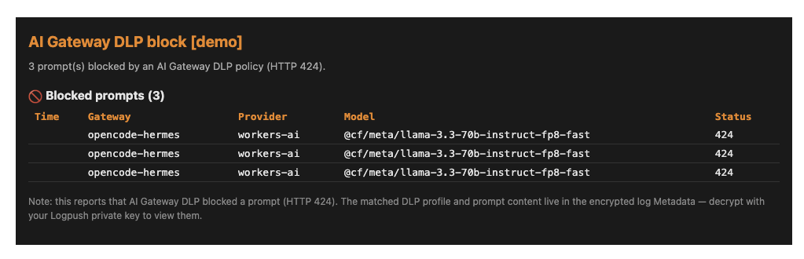
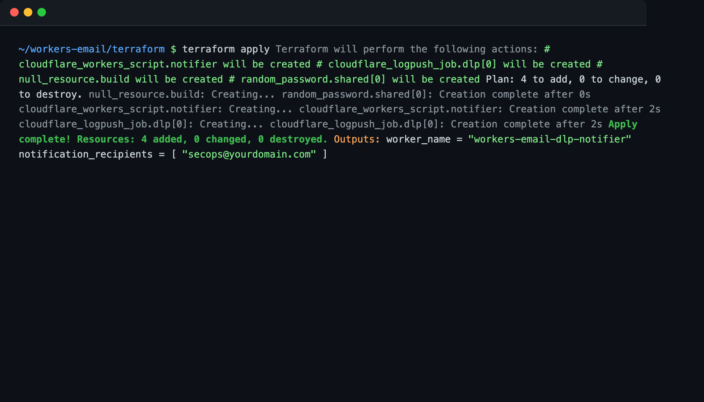
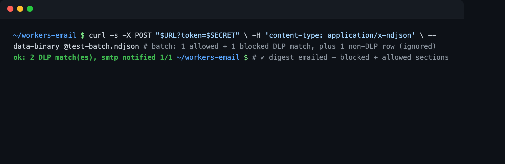
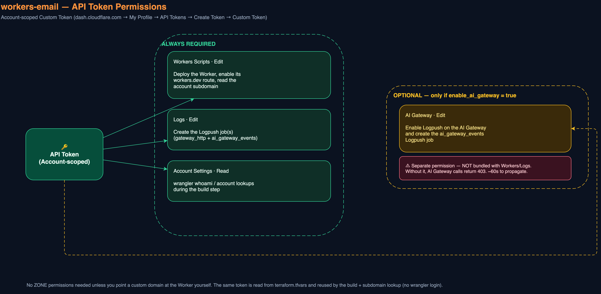

# workers-email — DLP notification via email

A Cloudflare Worker + Terraform module that **emails a digest when a DLP profile
matches** in Gateway HTTP traffic — for **blocked _and_ allowed** matches.

The customer ask this solves: *"notify me by email when a DLP policy is
triggered"* — without standing up a SIEM. Cloudflare has no native
"DLP-triggered → email" alert type today, so this wires **Logpush → Worker →
email** and lets you pick exactly who gets notified.

## What it does



*(Editable source: [`docs/architecture.drawio`](docs/architecture.drawio))*

```
Gateway HTTP traffic ─(DLP profile matches)─> Logpush (gateway_http dataset)
        │
        ▼
   Worker (this repo): keep rows where DLPProfiles is non-empty
        │  split into  🚫 Blocked   and   ⚠️ Allowed (DLP triggered, action=allow)
        ▼
   Cloudflare Email Sending  ──>  your recipient list
```

- **Notifies on ALLOWED too.** Filtering is on *"a DLP profile matched"*, not on
  the action — so a profile that fires on an `allow`/log-only policy still emails
  you. The digest separates blocked vs allowed sections.
- **Pick your recipients.** `notification_recipients` is a Terraform list. Edit
  it, `terraform apply`, done.
- **No third-party email service, no SMTP.** Uses the Cloudflare Email Sending
  `send_email` binding.
- **Portable.** The Worker source has zero hardcoded account values — everything
  arrives as bindings. A colleague clones the repo, fills in their own
  `terraform.tfvars`, and applies.

## What the notification emails look like

Gateway HTTP DLP — one digest, blocked **and** allowed matches split into sections:



Optional AI Gateway DLP — blocked prompts (HTTP 424) from a Cloudflare AI Gateway:



## See it working

Deploy with Terraform:



Send a test event and get `smtp notified`:



> Full step-by-step (both zsh/bash and nushell) is in
> [`docs/testing.md`](docs/testing.md).

## Repo layout

```
workers-email/
├── src/index.js              # the Worker (filter + digest + email fan-out)
├── wrangler.jsonc            # Worker config (send_email binding, workers_dev)
├── package.json
└── terraform/
    ├── providers.tf          # cloudflare v5 + null + random
    ├── variables.tf          # all variables (recipients, from_address, ...)
    ├── locals.tf             # shared secret, recipients CSV
    ├── worker.tf             # cloudflare_workers_script + bindings
    ├── logpush.tf            # cloudflare_logpush_job (gateway_http)
    ├── build.tf              # bundles the Worker via wrangler --dry-run
    ├── outputs.tf            # worker name, job id, next_steps, verify cmds
    └── terraform.tfvars.example
```

## Prerequisites

These are **not** created by this module — they are account-level Cloudflare One
config the notification depends on:

1. **Gateway HTTP filtering + TLS inspection ON.** DLP can only match decrypted
   HTTPS. No inspection → no DLP rows → no email.
2. **At least one DLP profile wired into a Gateway HTTP policy.** A profile alone
   detects nothing; it must be referenced by an HTTP rule (action `block` or
   `allow`).
3. **Email Sending onboarded for the sender domain:**
   ```bash
   npx wrangler email sending enable yourdomain.com
   ```
   Then `from_address` can be anything `@yourdomain.com`.

### API token scopes



*(Editable source: [`docs/api-token-permissions.drawio`](docs/api-token-permissions.drawio))*

Create an **Account-scoped API token** (My Profile → API Tokens → Create Token →
Custom Token) with these permissions:

**Always required:**
| Permission | Level | Why |
|---|---|---|
| **Workers Scripts: Edit** | Account | Deploy the Worker + enable its workers.dev route + read the account subdomain |
| **Logs: Edit** | Account | Create the Logpush job(s) |
| **Account Settings: Read** | Account | `wrangler whoami` / account lookups during build |

**Only if `enable_ai_gateway = true`:**
| Permission | Level | Why |
|---|---|---|
| **AI Gateway: Edit** | Account | Enable Logpush on the AI Gateway and create the `ai_gateway_events` Logpush job |

Notes:
- **AI Gateway is a SEPARATE permission** — it is *not* bundled with Workers/Logs
  scopes. A token without it returns `403` on the AI Gateway calls. Scope changes
  take ~60s to propagate.
- No **zone** permissions are needed unless you point a custom domain at the
  Worker yourself (that's outside this module).
- The same token is read from `terraform.tfvars` and reused by the build step and
  the subdomain lookup — it never needs `wrangler login`.

## Deploy

Terraform bundles the Worker (via `wrangler deploy --dry-run`), uploads it,
enables its workers.dev route, and auto-derives that URL for the Logpush
job(s) — so **you never hand-copy the Worker URL**.

```bash
cd terraform
cp terraform.tfvars.example terraform.tfvars
# edit terraform.tfvars: token, account id, recipients, from_address, SMTP creds

terraform init
terraform apply
```

**It may take two `terraform apply` runs the first time.** The first apply
creates the Worker and enables its `workers.dev` route; Cloudflare validates a
Logpush destination by POSTing to it *at creation time*, and the freshly-enabled
route can take a few seconds to answer. If the Logpush job errors on the first
apply, just run `terraform apply` again — the route is live by then and the job
creates cleanly. This is a propagation timing quirk, not a config step: the URL
is still derived automatically, you never edit it.

> **Custom domain instead of workers.dev?** Set `worker_endpoint` to your URL
> (e.g. `https://dlp-notify.example.com`) and that overrides the auto-derived
> one. The shared secret (`?token=`) protects the endpoint either way.

## Change who gets notified

```hcl
# terraform.tfvars
notification_recipients = [
  "secops@yourdomain.com",
  "soc-oncall@yourdomain.com",
  "dpo@yourdomain.com",
]
```
```bash
terraform apply
```

Recipients are also enforced at the binding level
(`allowed_destination_addresses`), so the Worker can only email the configured
list.

## Test without waiting for real traffic

```bash
SECRET=$(terraform output -raw shared_secret)
URL=$(terraform output -raw worker_name >/dev/null; echo "<your worker_endpoint>")

curl -X POST "$URL?token=$SECRET" \
  -H 'content-type: application/x-ndjson' \
  --data-binary '{"Datetime":"2026-01-01T00:00:00Z","Email":"tester@x.com","HTTPHost":"paste.example.com","Action":"allow","PolicyName":"Monitor secrets","DLPProfiles":["Credentials and Secrets"]}
{"Datetime":"2026-01-01T00:00:05Z","Email":"tester@x.com","HTTPHost":"upload.example.com","Action":"block","PolicyName":"Block PII","DLPProfiles":["Social Security, Insurance, Tax, and Identifier Numbers"]}'
```

You should get one email with a **🚫 Blocked (1)** and a **⚠️ Allowed (1)**
section.

## Sender options (notify_mode)

The Worker supports three transports, chosen by `notify_mode`:

| `notify_mode` | How mail leaves | Cloudflare email onboarding? | DNS changes? |
|---|---|---|---|
| `log` (default) | none — logs + returns the digest as JSON | no | no |
| `cf_email` | Cloudflare `send_email` binding | **yes** (Email Routing/Sending) | yes (MX/TXT) |
| `smtp` | relays through **your own mail server** | no | no |

### SMTP transport (relay through the customer's own mail server)

This is usually the enterprise-friendly option: the DLP alert goes out through
the customer's existing mail relay — no Cloudflare email onboarding, no DNS
changes on Cloudflare's side, and the mail originates from infrastructure their
SOC already trusts.

```hcl
# terraform.tfvars
notify_mode = "smtp"
from_address = "dlp-alerts@customer.com"
notification_recipients = ["soc@customer.com"]

smtp_host = "smtp.customer.com"
smtp_port = 587            # 587 STARTTLS  or  465 implicit TLS
smtp_tls  = "starttls"     # "starttls" | "tls" | "none"
smtp_user = "dlp-notifier@customer.com"
smtp_pass = "REPLACE"      # stored as a Worker secret binding
```

**Hard limit — Cloudflare blocks outbound TCP port 25 from Workers.** The relay
MUST be a submission port (587 STARTTLS or 465 implicit TLS) with auth. A plain
port-25 MTA is not reachable from a Worker. This is a Cloudflare platform
restriction, not a limitation of this code.

The Worker speaks SMTP directly via the `cloudflare:sockets` API (`connect()` +
`startTls()`), with `AUTH LOGIN`. No third-party mail service and no
`nodemailer` (which does not run on the Workers runtime).

**Gotcha — switching modes leaves the old secret behind.** Terraform's
`cloudflare_workers_script` binding list does not purge a `secret_text` binding
it no longer declares. If you deploy `smtp` (which sets `SMTP_PASS`) and later
switch back to `log`/`cf_email`, the `SMTP_PASS` secret survives on the script.
Remove it explicitly:

```bash
curl -X DELETE -H "Authorization: Bearer $CLOUDFLARE_API_TOKEN" \
  "https://api.cloudflare.com/client/v4/accounts/$ACCT/workers/scripts/$WORKER/secrets/SMTP_PASS"
```

> Inbound SMTP ("server in") is **not** a Worker feature — a Worker cannot listen
> on a TCP port. If you need to *receive* mail, that's Cloudflare Email Routing
> → a Worker `email()` handler, a separate mechanism from this outbound notifier.

## Reproducing the AI Gateway DLP config

The Terraform module creates the *Logpush* wiring, but the AI Gateway's **DLP
policy itself** (which profiles it blocks) is **not** manageable by the
cloudflare v5 provider — it's dashboard/REST-API only. Use the helper script to
make it reproducible:

```bash
export CLOUDFLARE_API_TOKEN=...   # AI Gateway:Edit + DLP:Edit
scripts/configure-ai-gateway-dlp.sh <account_id> <gateway_name>
```

It snapshots the gateway first, enables detection entries on the chosen
predefined profiles (a profile with no enabled entries detects nothing), and
merge-safely sets the gateway's DLP policy (BLOCK / REQUEST) without wiping
logpush or other settings. Edit `PROFILE_IDS` in the script for your coverage.
Wait ~20-30s after running before testing — profile changes take time to
propagate.

## Important limitation to set with the customer

This alert reports **that** a DLP profile matched (user, host, profile, policy,
action). It does **not** contain the matched sensitive value itself. To capture
the actual content, enable **DLP Payload Logging** (Zero Trust → DLP → Settings)
— that's a separate, encrypted store you decrypt locally. Keeping the sensitive
value out of routine email is the safer default anyway.

## How "notify on allowed" works (the #4 ask)

Gateway HTTP logs include a `DLPProfiles` array on every request a DLP profile
matched — regardless of whether the policy's action was `block` or `allow`. The
Worker keeps every row with a non-empty `DLPProfiles` and buckets by `Action`.
So a "monitor-mode" DLP policy (action = allow, used while tuning false
positives) still generates email — exactly the visibility you want before you
switch a policy to block.

## Teardown

```bash
cd terraform
terraform destroy
```
This removes the Worker and the Logpush job. It does not touch your Gateway
policies, DLP profiles, or Email Sending onboarding.
